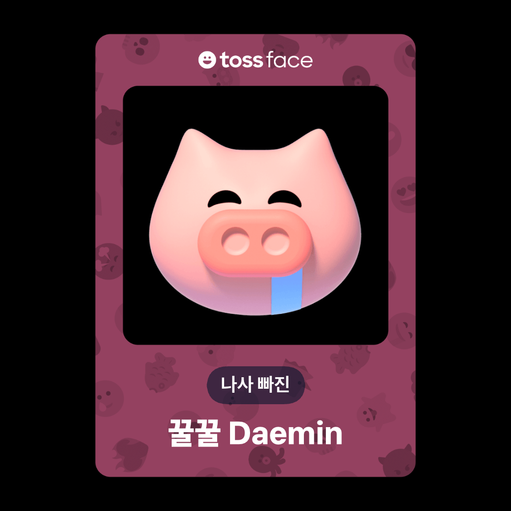

[version]: https://img.shields.io/npm/v/mayoui-react?style=flat-square&label=version
[commit]: https://img.shields.io/github/last-commit/AnDaemin/mayoui?style=flat-square
[license]: https://img.shields.io/github/license/AnDaemin/mayoui?style=flat-square
[stars]: https://img.shields.io/github/stars/AnDaemin/mayoui?style=flat-square

<div align = center>



<h3>한국인이 사용하기 쉬운 UI 를 만드는게 목표입니다</h3>

[![][version]](https://www.npmjs.com/package/Mayoui-react)
[![][commit]](https://github.com/AnDaemin/mayoui)
[![][license]](https://github.com/AnDaemin/mayoui/blob/main/LICENSE)
[![][stars]](https://github.com/AnDaemin/mayoui/stargazers)

</div>

# MayoUI

<h3>💡 MayoUI는 &nbsp&nbsp <a href="https://github.com/orioncactus/pretendard">'Pretendard'</a>&nbsp&nbsp 폰트와

<a href="https://github.com/toss/tossface">'TossFaceFont'</a>
사용을 권장합니다</h3>

```bash
npm install mayoui
```

<h3> <a href=""> ✅ 공식 문서 (미완)</a> <h3>

<h3> <a href=""> ❓ 사용 방법 (미완)</a> <h3>

---
